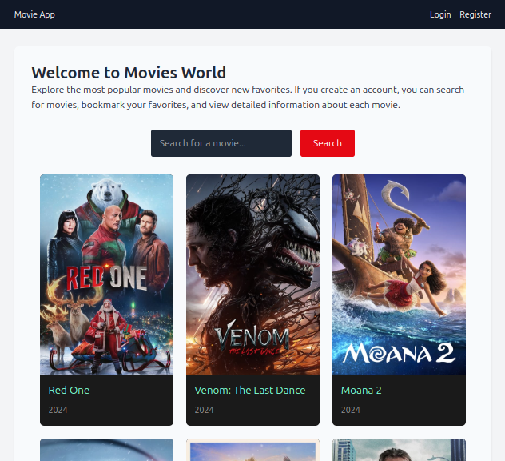

# Full Stack Movie Application

This project is a fullstack application consisting of a [FastAPI](https://fastapi.tiangolo.com/) backend for user authentication and management, and a [React](https://reactjs.org/) frontend for browsing movies from [The Movie Database (TMDB)](https://www.themoviedb.org/), user registration, and managing favorite movies. The application utilizes [Docker Compose](https://docs.docker.com/compose/) for easy deployment.

## Features

### Backend (FastAPI)

- User registration with unique username and email verification.
- User login with JWT-based authentication.
- Secure password hashing and verification.
- Retrieve current authenticated user information.
- CORS support for frontend integration.

### Frontend (React)

- Browse popular movies from **TMDB**.
- Search for movies by title.
- Register, login, and logout functionality.
- View user profile with username and email.
- Manage favorite movies with add/remove functionality.
- Responsive design using `Tailwind CSS`.
- Notifications for user interactions using `react-toastify`

## Project Structure

### Backend

- **`main.py`**: Configures the FastAPI application, middleware, and routers.
- **`database.py`**: Sets up SQLAlchemy database engine and session management.
- **`models.py`**: Contains SQLAlchemy ORM model definitions.
- **`schemas.py`**: Defines Pydantic models for validation.
- **`routers/`**: Includes:
  - `user.py`: User-related endpoints.
  - `auth.py`: Authentication endpoints.
- **`auth/`**: Authentication utilities including password hashing and JWT token handling.

### Frontend

- **`services/`**: API interaction logic for TMDB and authentication.
- **`pages/`**: Main application pages like Home, Login, and Register.
- **`components/`**: Reusable UI components such as MovieCard and Navbar.
- **`contexts/`**: Context providers for authentication and movie management.
- **`layouts/`**: Layout components such as MainLayout.

## Getting Started

### Prerequisites

- Python 3.11+
- Node.js
- Docker and Docker Compose

### Installation

1. Clone the repository:

   ```bash
   git clone <repository-url>
   cd <project-directory>
   ```

2. Set up environment variables:

   Rename the `env.txt` file to `.env` in the `frontend` directory with your TMDB API key:

   ```plaintext
   REACT_APP_THEMOVIEDB_API_KEY=your_tmdb_api_key
   ```

   **Note**: You can get your TMDB API key [here](https://www.themoviedb.org/documentation/api).

### Running the Application Without Docker

1. **Backend Setup**:

   - Navigate to the backend directory:

     ```bash
     cd backend
     ```

   - Create and activate a virtual environment:

     ```bash
     python -m venv venv
     source venv/bin/activate
     # On Windows use`venv\Scripts\activate`
     ```

   - Install the dependencies:

     ```bash
     pip install -r requirements.txt
     ```

   - Start the FastAPI application:

     ```bash
     uvicorn src.main:app --reload
     ```

2. **Frontend Setup**:

   - Open a new terminal and navigate to the frontend directory:

     ```bash
     cd frontend
     ```

   - Install the required packages:

     ```bash
     npm install
     ```

   - Start the development server:

     ```bash
     npm run dev
     ```

3. Access the application:
   - Backend API documentation: http://localhost:8000/docs
   - Frontend application: http://localhost:3000

### Running the Application With Docker

1. Run the application using Docker Compose:

   ```bash
   docker compose up --build
   ```

   This command will build and start both the FastAPI and React services.

2. Access the application:
   - Backend API documentation: http://localhost:8000/docs
   - Frontend application: http://localhost:3000

Choose the setup that suits your development environment requirements.

## Usage

- **Home Page**: Browse and search popular movies.
- **Movie Details**: View detailed movie information.
- **User Management**: Register, login, and manage profile.
- **Favorites**: Add or remove movies from your favorites list.

## Security

- JWT-based authentication for secure access.
- Passwords securely hashed with bcrypt.
- CORS support for frontend integration.

## Screen shots

### Home Page


## License

This project is licensed under the MIT License. See the [LICENSE](LICENSE) file for more details.
